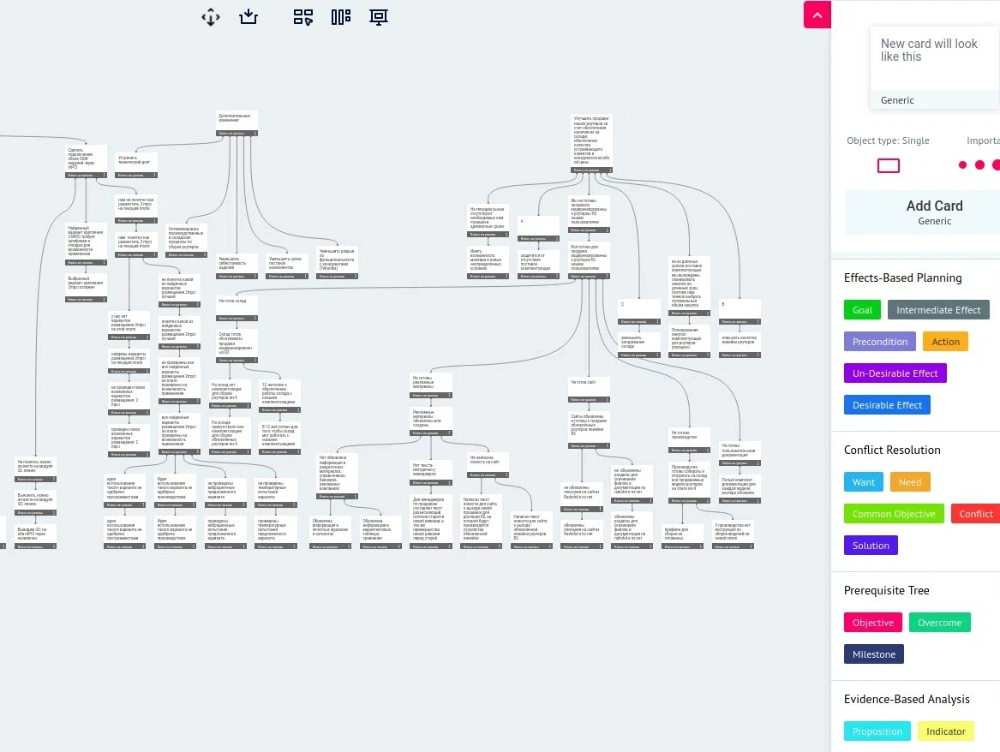

Тут в [канбановском чатике](https://t.me/kanban_talks/49370) посоветовали обалденный инструмент для рисования TOCшных диаграмм. Очень хорошая альтернатива дорогущему Flyinglogic: [www.knowflow.io](https://www.knowflow.io)

Судя по всему разработчики из России, похоже можно не бояться блокировок.

Денег пока что не просят.

Из фишечек:

- Есть совместная работа над диаграммами в онлайне
- Есть возможность создавать свои пресеты-шаблоны
- Есть экспорт и импорт из/в популярные форматы, в том числе .xlogic
- Выглядит приятно
- Есть режим презентации - очень удобно передвигаться по дереву, фокусируя внимание на конкретной сущности

