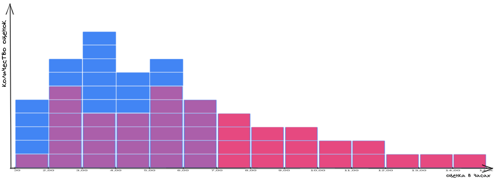

Знакомьтесь. Это Вася.

Вася - настоящий мужик - за базар отвечает. Обещания свои держит всегда.

Если Вася сказал, что сделает работу к такому-то сроку, то не сомневайтесь — обязательно сделает.

Сегодня поразмышляем над тем, как нам быть такими же как Вася - надёжными в своих обещаниях.  Ещё затронем такое понятие как вариабельность и наличие этой вариабельности в процессах с которыми мы имеем дело. 

Вася работает с нами и мы время от времени просим поделать его всякую работу. И перед тем как дать ему эту работу, мы спрашиваем за сколько он её сделает. На основе Васиных оценок мы принимаем безумно важные менеджерские решения.
Интересно узнать как часто мы приносим Васе короткую работу, и как часто длительную.

Соберём статистику! 

Что здесь можно сказать? Видим некую вариабельность в оценках, которые нам выдаёт Вася. Какие-то задачи Вася готов сделать за час, а какие-то за шесть часов.  

Давайте посчитаем количество каждой из оценок. Возьмем оценки в один час. Посчитаем сколько таких штук у нас получилось. Положим на график. Возьмём оценки в два часа, посчитаем их количество, положим рядом. И так далее.

Можно заметить что у двух наших графиков будет одна общая ось - ось оценок в часах.

Давайте посмотрим на получившуюся гистограмму и подумаем что она означает.

Видим, что больше всего к Васе попадает задач, которые он оценивает в 5 часов. Задач, которые Вася оценивает в 4 часа меньше всех. С таким набором данных можно сказать что _скорее всего_ Вася сделает любую поставленную ему задачу за 5 часов. Иногда он сделает её за час. А за 6 часов он точно справится.

Вася — крутой и надёжный специалист!

Но что-то у нас мало данных. Надо собрать ещё. Снова идём донимать Васю. 

А если повернуть?

Что тут у нас? Видите выброс в 25 часов где-то на 50й отметке?
Похоже, что Вася иногда делает свою работу дольше чем обычно.
Получается, что изредка к нему попадают задачи, которые он за 6 часов сделать не сможет.

Что мы теперь можем сказать про вероятность выполнения любой задачи, прилетевшей к Васе?

Мы уже не можем говорить, что Вася выполнит любую задачу за 6 часов. Мы можем сказать, что Вася _скорее всего_ выполнит любую задачу за 6-7 часов, но с гарантией только за 25 часов.

Получается, что точность нашего прогноза сильно снизилась.

Всего из-за одной задачи мы теперь должны закладывать гораздо больше времени в наши планы. Это приходится делать, чтобы подстраховать себя от редких, но возможных задержек.

С такими запасами времени на подстраховку мы будем всё делать намного дольше, а больше половины времени Вася будет простаивать.

Просто так мы игнорировать этот выброс не можем, потому что иначе, при столкновении с такой задачей у нас развалятся все процессы зависящие от Васи. Два раза из ста мы будем выглядеть очень нехорошими людьми. Не хочется.

Что же делать?

Давайте спросим у Васи: _"А почему в этом вот случае ты дал именно такую оценку? С чем это связано?"_

А Вася ответит: _"Для этой задачи мне нужно привлекать Петю, а он вечно занят. Нужно за ним бегать и упрашивать уделить мне время и внимание. Мне постоянно приходится напоминать ему р своей задаче."_

Похоже что-то начинает проясняться. 

Давайте уточним у Васи: "А если мы попросим Петю помочь тебе сразу же, как только ты обратишься. Если Петя будет реагировать на твои просьбы моментально, то за сколько сделаешь?"

Вася: "Ну, в этом случае за 8 часов справлюсь!"

Опа!

Вот так мы отрезали длинный хвост у нашего распределения вероятностей выполнения задачи и можем с уверенностью заявлять, что Вася сделает любую работу за 8 часов!

Вася выдаёт оценки. Мы знаем разброс этих оценок и можем на них опираться в нашей деятельности.

Красота-то какая! Лепота!

Но вот, проходит время и мы начинаем замечать, что Вася стал ошибаться в своих оценках. Обещал сделать за 3 дня, а делает за 5, а то и за 7. Но самое печальное в том, что стали попадаться такие задачи, опоздание по которым превышает все мыслимые пределы.

Вот иллюстрация. Синим - то что было запланировано: от одного до шести дней. Красным то, как получилось по факту: многие задачи были сделаны больше чем за 12 дней.

Мы больше не можем доверять нашему методу оценки. Вася перестал держать слово - его репутация под угрозой!

Давайте узнаем мнение Васи, почему так получается:

\- Вась, что случилось, почему перестал попадать в оценки?

\- Да работа изменилась. Раньше всё было просто. Делай-раз, делай-два. Работа была понятная и отличалась в мелочах. А теперь тут каждый раз думать надо. Ничего на старте непонятно. Задачи друг на друга не похожи и многие приходится решать впервые.

Похоже, что дело не в Васе. Изменилась сама работа, которую мы просим его делать. И у этой работы есть какая-то особенность, какое-то препятствие, которое мешает Васе давать точные прогнозы. 

Тут возникают такие вопросы: 
- Что значит не точный прогноз?
- Можем ли мы получить пользу от не точных прогнозов?
- Как нам найти это препятствие к точному прогнозу? 
- Сможем ли мы что-то сделать с этим препятствием для повышения точности прогноза?

Давайте по порядку.

Не точный прогноз это такой прогноз у которого снижена точность (Спасибо, кэп!).
На практике это значит, что у нас есть какой-то диапазон значений, куда мы можем попасть с какой-то долей вероятности. Получается, что у нас есть вариабельность уже внутри нашей оценки. Давайте попробуем спрашивать у Васи границы этой вариабельности. Так мы получим какие-то рамки прогноза, на которые сможем опираться в дальнейшем.

\- Вась, вот тебе работка, за сколько справишься?

\- Ну, не знаю, наверное часов за шесть.

\- А почему "наверное", точно оценить можешь?

\- Нет, точно не могу.

\- Ну оцени тогда в общих чертах, приблизительно. За сколько сделаешь, если всё пойдёт идеально, если тебе ничего не будет мешать? И за сколько сделаешь если всё будет против тебя?

\- Ну, если всё пойдёт гладко, я справлюсь за четыре часа, а если всё пойдёт наперекосяк, то смогу победить часов за 15.

Отлично! 

Теперь оценка от Васи выглядит как диапазон от 4 до 15 часов. Хотя изначально была 6. 
Почему так? Дело в том, что не имея возможности сказать точную оценку, Вася выдавал наиболее вероятную. То есть оптимистичную оценку, плюс ещё какой-то запас времени на непредвиденные ситуации. Но этого запаса времени всё равно иногда не хватало, поэтому Вася и не вписывался в обещанную дату завершения. 

Давайте соберём статистику с такими диапазонными значениями.

Какие выводы можно сделать из собранных данных?

Например, такие:
Одни задачи мы делаем с низкой вариабельностью, у других задач вариабельность оценки высокая.

Значит, что у нас есть разные типы задач. В зависимости от типа задачи изменяется точность её прогноза.

Давайте разберёмся, что это за типы задач такие и в чём их отличие друг от друга.

Поговорив с Васей, выясняем следующее:

- Есть задачи по которым Вася даёт точный прогноз - это задачи понятные, он их уже знает, он такие уже делал.
- Есть задачи, где вариабельность прогноза не большая. Это задачи с которыми Вася сталкивается впервые, но они понятны и не содержат в себе много неожиданностей.
- Есть задачи с высокой вариабельностью оценки. Это задачи, которые Вася делает впервые, но там много не понятного и неясно с какими преградами можно столкнуться по пути.

-----
# Вариабельность присуща любому повторяющемуся процессу.

------

https://docs.google.com/spreadsheets/d/1n3qcrYfDIxXOFjeoMR59IMeNNCWQ1ql0ba2-Rf3jQBA/edit#gid=0

https://excalidraw.com/