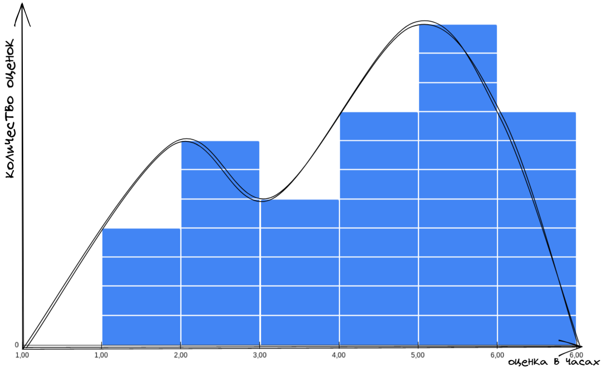

Знакомьтесь. Это Вася.

Вася - настоящий мужик - за базар отвечает. Обещания свои держит всегда.

Если Вася сказал, что сделает работу к такому-то сроку, то не сомневайтесь — обязательно сделает.

Сегодня мы поговорим про вариабельность, которая присуща любому процессу. 

Вася работает с нами и мы время от времени просим поделать его всякую работу. И перед тем как дать ему эту работу, мы спрашиваем за сколько он её сделает. На основе Васиных оценок мы принимаем безумно важные менеджерские решения.
Интересно узнать как часто мы приносим Васе короткую работу, и как часто длительную.

Соберём статистику! 

Что здесь можно сказать? Видим некую вариабельность в оценках, которые нам выдаёт Вася. Какие-то задачи Вася готов сделать за час, а какие-то за шесть часов.  

Давайте посчитаем количество каждой из оценок. Возьмем оценки в один час. Посчитаем сколько таких штук у нас получилось. Положим на график. Возьмём оценки в два часа, посчитаем их количество, положим рядом. И так далее.

Можно заметить что у двух наших графиков будет одна общая ось - ось оценок в часах.

Давайте посмотрим на получившуюся гистограмму и подумаем что она означает.

Видим, что больше всего к Васе попадает задач, которые он оценивает в 5 часов. Задач, которые Вася оценивает в 4 часа меньше всех. С таким набором данных можно сказать что _скорее_ всего Вася сделает любую поставленную ему задачу за 5 часов. Иногда он сделает её за час. А за 6 часов он точно справится.

Вася - крутой и надёжный специалист!

Но что-то у нас мало данных. Надо собрать ещё. Снова идём донимать Васю. 

А если повернуть?

Что тут у нас? Видите выброс в 25 часов где-то на 50й отметке?
Похоже, что Вася иногда делает свою работу дольше чем обычно.
Получается, что изредка к нему попадают задачи, которые он за 6 часов сделать не сможет.

Что мы теперь можем сказать про вероятность выполнения любой задачи, прилетевшей к Васе?

Мы уже не можем говорить, что Вася выполнит любую задачу за 6 часов. Мы можем сказать, что Вася _скорее всего_ выполнит любую задачу за 6-7 часов, но с гарантией только за 25 часов.

Получается, что точность нашего прогноза сильно снизилась.

Всего из-за одной задачи мы теперь должны закладывать гораздо больше времени в наши планы. Это приходится делать, чтобы подстраховать себя от редких, но возможных задержек.

С такими запасами времени на подстраховку мы будем всё делать намного дольше, а больше половины времени Вася будет простаивать.

Просто так мы игнорировать этот выброс не можем, потому что иначе, при столкновении с такой задачей у нас развалятся все процессы зависящие от Васи. Два раза из ста мы будем выглядеть очень нехорошими людьми. Не хочется.

Что же делать?

Давайте спросим у Васи: _"А почему в этом вот случае ты дал именно такую оценку? С чем это связано?"_

А Вася ответит: _"Для этой задачи мне нужно привлекать Петю, а он вечно занят и приходится за ним бегать и упрашивать уделить мне время и внимание. Всё время приходится напоминать о своей задаче."_

Похоже что-то начинает проясняться. 

Давайте уточним у Васи: "А если мы попросим Петю помочь тебе сразу же, как только ты обратишься. Если Петя будет реагировать на твои просьбы моментально, то за сколько сделаешь?"

Вася: "Ну, в этом случае за 8 часов справлюсь!"

Опа!
Вот так мы отрезали длинный хвост у нашего распределения вероятностей выполнения задачи и можем с уверенностью заявлять, что Вася сделает любую работу за 8 часов!

Вася выдаёт оценки. Мы знаем разброс этих оценок и можем на них опираться в нашей дейтельности.

Красота-то какая! Лепота!

------

https://docs.google.com/spreadsheets/d/1n3qcrYfDIxXOFjeoMR59IMeNNCWQ1ql0ba2-Rf3jQBA/edit#gid=0

https://excalidraw.com/