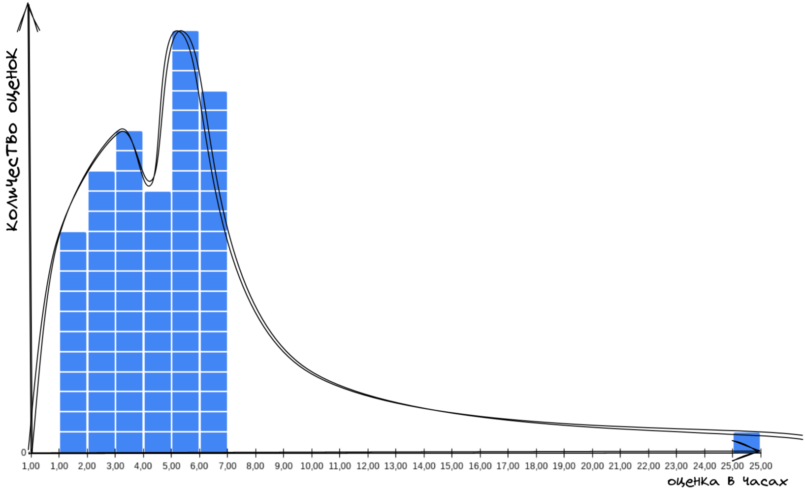

Знакомьтесь. Это Вася.

Вася - настоящий мужик - за базар отвечает. Обещания свои держит всегда.

Если Вася сказал, что сделает работу к такому-то сроку, то не сомневайтесь — обязательно сделает.

Сегодня поразмышляем над тем, как нам быть такими же как Вася - надёжными в своих обещаниях.  Ещё затронем такое понятие как вариабельность и наличие этой вариабельности в процессах с которыми мы имеем дело. 

# Дописать и откорректировать текст в дисклеймерах
> Дисклеймер про нормальное распределение. Распределение у вас появляется, когда вы рассматриваете непрерывность чисел внутри диапазона. Здесь же мы не рассматриваем числа в диапазоне от 1 до 6. Мы рассматриваем какое количество раз выпадут числа от 1 до 6. Мы не складываем результаты этих чисел. Мы считаем сами результаты. Вероятность выпадения единицы точно такая же как и тройки, и шестёрки.

> Дисклеймер для Канбаньеров про виды распределения и распределение вейбула. Я здесь намеренно рассматриваю именно прогнозы оценок. Это немного не то, к чему привыкли Канбандиты, но это сделано намеренно. Выводы из этой статьи можно использовать как для прогноза, выдаваемого людьми, так и для обработки статистических данных собранных по вашей канбан-системе.Мы здесь проводим мысленный эксперимент в котором ориентируемся на _прогнозы оценок_. Это идеализированная ситуация в которой каждый прогноз может встретиться с такой же вероятностью, что и другой прогноз. Это сделано специально для того, чтобы показать обобщенный принцип работы с вариативными оценками. В реальной жизни, конечно же вероятность встречи с тем или иным типом задач будет разная и будет задаваться верхней системой. Поэтому вместо равномерного распределения мы получим какое-то иное. 

Вася работает с нами и мы время от времени просим поделать его всякую работу. И перед тем как дать ему эту работу, мы спрашиваем за сколько он её сделает. На основе Васиных оценок мы принимаем безумно важные менеджерские решения.
Интересно узнать как часто мы приносим Васе короткую работу, и как часто длительную.

Соберём статистику! 

Что здесь можно сказать? Видим некую вариабельность в оценках, которые нам выдаёт Вася. Какие-то задачи Вася готов сделать за час, а какие-то за шесть часов.  

Давайте посчитаем количество каждой из оценок. Возьмем оценки в один час. Посчитаем сколько таких штук у нас получилось. Положим на график. Возьмём оценки в два часа, посчитаем их количество, положим рядом. И так далее.

Можно заметить что у двух наших графиков будет одна общая ось - ось оценок в часах.

Давайте посмотрим на получившуюся гистограмму и подумаем что она означает.

Видим, что больше всего к Васе попадает задач, которые он оценивает в 5 часов. Задач, которые Вася оценивает в 4 часа меньше всех. С таким набором данных можно сказать что _скорее всего_ Вася сделает любую поставленную ему задачу за 5 часов. Иногда он сделает её за час. А за 6 часов он точно справится.

Вася — крутой и надёжный специалист!

Но что-то у нас мало данных. Надо собрать ещё. Снова идём донимать Васю. 

А если повернуть?

Что тут у нас? Видите выброс в 25 часов где-то на 50й отметке?
Похоже, что Вася иногда делает свою работу дольше чем обычно.
Получается, что изредка к нему попадают задачи, которые он за 6 часов сделать не сможет.

Что мы теперь можем сказать про вероятность выполнения любой задачи, прилетевшей к Васе?

Мы уже не можем говорить, что Вася выполнит любую задачу за 6 часов. Мы можем сказать, что Вася _скорее всего_ выполнит любую задачу за 6-7 часов, но с гарантией только за 25 часов.

Получается, что точность нашего прогноза сильно снизилась.

Всего из-за одной задачи мы теперь должны закладывать гораздо больше времени в наши планы. Это приходится делать, чтобы подстраховать себя от редких, но возможных задержек.

С такими запасами времени на подстраховку мы будем всё делать намного дольше, а больше половины времени Вася будет простаивать.

Просто так мы игнорировать этот выброс не можем, потому что иначе, при столкновении с такой задачей у нас развалятся все процессы зависящие от Васи. Два раза из ста мы будем выглядеть очень нехорошими людьми. Не хочется.

Что же делать?

Давайте спросим у Васи: _"А почему в этом вот случае ты дал именно такую оценку? С чем это связано?"_

А Вася ответит: _"Для этой задачи мне нужно привлекать Петю, а он вечно занят. Нужно за ним бегать и упрашивать уделить мне время и внимание. Мне постоянно приходится напоминать ему р своей задаче."_

Похоже что-то начинает проясняться. 

Давайте уточним у Васи: "Давай мы попросим Петю помочь тебе сразу же, как только ты к нему обратишься. Петя будет реагировать на твои просьбы моментально. С таким подходом за сколько сделаешь?"

Вася: "Ну, в этом случае за 8 часов справлюсь!"

Опа!

Вот так мы отрезали длинный хвост у нашего распределения вероятностей выполнения задачи. Теперь можем с уверенностью заявлять, что Вася сделает любую работу за 8 часов!

Вася выдаёт оценки. Мы знаем разброс этих оценок. А редкие неожиданные ситуации мы победили. Теперь не только Вася может говорить, что он надёжный специалист, но и мы можем быть уверены, что наша система оценки задач - надёжна и её можно успешно использовать в нашей деятельности по планированию работ.

Красота-то какая! Лепота!

Но вот, проходит время и мы начинаем замечать, что Вася стал ошибаться в своих оценках. Обещал сделать за 3 дня, а делает за 5, а то и за 7. Но самое печальное в том, что стали попадаться такие задачи, опоздание по которым превышает все мыслимые пределы.

Вот иллюстрация. Синим - то что было запланировано: от одного до шести часов. Красным то, как получилось по факту: многие задачи были сделаны больше чем за 12 часов.

Мы больше не можем доверять нашему методу оценки. Вася перестал держать слово - его репутация под угрозой!

Давайте узнаем мнение Васи, почему так получается:

\- Вась, что случилось, почему перестал попадать в оценки?

\- Да работа изменилась. Раньше всё было просто. Делай-раз, делай-два. Работа была понятная и отличалась в мелочах. А теперь тут каждый раз думать надо. Ничего на старте непонятно. Задачи друг на друга не похожи и многие приходится решать впервые.

Похоже, что дело не в Васе. Изменилась сама работа, которую мы просим его делать. И у этой работы есть какая-то особенность, какое-то препятствие, которое мешает Васе давать точные прогнозы. 

Тут возникают такие вопросы: 
- Что значит не точный прогноз?
- Можем ли мы получить пользу от не точных прогнозов?
- Как нам найти это препятствие к точному прогнозу? 
- Сможем ли мы что-то сделать с этим препятствием для повышения точности прогноза?

Давайте по порядку.

### Что для нас значит не точный прогноз?

Не точный прогноз это такой прогноз у которого снижена точность (Спасибо, кэп!).
На практике это значит, что у нас есть какой-то диапазон значений, куда мы можем попасть с какой-то долей вероятности. Получается, что у нас есть вариабельность уже внутри нашей оценки. Давайте попробуем спрашивать у Васи границы этой вариабельности. Так мы получим какие-то рамки прогноза, на которые сможем опираться в дальнейшем.

\- Вась, вот тебе работка, за сколько справишься?

\- Ну, не знаю, наверное часов за шесть.

\- А почему "наверное", точно оценить можешь?

\- Нет, точно не могу.

\- Ну оцени тогда в общих чертах, приблизительно. За сколько сделаешь, если всё пойдёт идеально, если тебе ничего не будет мешать? И за сколько сделаешь если всё будет против тебя?

\- Ну, если всё пойдёт гладко, я справлюсь за четыре часа, а если всё пойдёт наперекосяк, то смогу победить часов за 15.

Отлично! 

Теперь оценка от Васи выглядит как диапазон от 4 до 15 часов. Хотя изначально была 6. 
Почему так? Дело в том, что не имея возможности сказать точную оценку, Вася выдавал наиболее вероятную. То есть оптимистичную оценку, плюс ещё какой-то запас времени на непредвиденные ситуации. Но этого запаса времени всё равно иногда не хватало, поэтому Вася и не вписывался в обещанную дату завершения. 

### Можем ли мы получить пользу от не точных прогнозов?

Для того, чтобы разобраться какую пользу мы можем получить от не точного прогноза, давайте соберём статистику с оценками по оптимистичному и пессимистичному прогнозу.

Теперь построим гистограмму плотности распределения вероятности отдельно по оптимистичной оценке, отдельно по пессимистичной.

Как видите, у оптимистичных оценок разброс значительно меньше.

Давайте посмотрим, что случится, если объединить эти две гистограммы в одну.

Вероятность выполнения задачи сместилась влево.  Это произошло из-за влияния оптимистичной оценки. В то же время мы получили длинный хвост на распределении. Так повлияла широкая пессимистична оценка.

Глядя на это распределение вероятностей прогноза выполнения задач, можно прикинуть, когда Вася планирует закончить работу. 
Например, можно сказать, что с 50% вероятностью Вася сделает задачу за 6 часов, а с 90% вероятностью за 11 часов. Вероятность в 100% это около 15 часов.

Круто! У нас появился хоть какой-то способ оценки! По важным, критичным для нас задачам мы можем теперь выдавать прогноз в 15 часов. По обычным - 11 часов. При этом мы знаем, что половина всех задач будет выполнена меньше чем за 6 часов. 

Неплохо, но что если нам понадобится выполнить важную, но не большую задачку? Нельзя ли её сделать быстрее чем за 15 часов?

Давайте снова посмотрим на собранную статистику. Подсветим на ней диапазоны в каждой одной оценке.

Похоже, что нам встречаются разные задачи - у одних большой размах между оптимистичной и пессимистичной оценкой у других - маленький.

Поговорив с Васей, выясняем следующее:

- Есть задачи по которым Вася даёт точный прогноз - это задачи понятные, он их уже знает, он такие уже делал.
- Есть задачи, где вариабельность прогноза не большая. Это задачи с которыми Вася сталкивается впервые, но они понятны и не содержат в себе много неожиданностей.
- Есть задачи с высокой вариабельностью оценки. Это задачи, которые Вася делает впервые, но там много не понятного и неясно с какими преградами можно столкнуться по пути.

Будет удобно разделить эти прогнозы на три типа:
- с низкой вариабельностью
- со средней вариабельностью
- с высокой вариабельностью.

Прогнозы с низкой вариабельностью нас устраивают. Оценки тут вполне точные. 

А вот что делать с двумя другими группами - со средней и высокой вариабельностью?

Отфильтруем из выборки оценки с низкой вариабельностью. А для оценок со средней и высокой вариабельностью повторим анализ из предыдущего этапа - для каждой группы построим распределение вероятности по пессимистичному и оптимистичному прогнозу.

Для средней вариабельности картинка такая

Если объединить две гистограммы, получится такое:

Здесь мы можем воспользоваться тем же способом вероятностного прогноза, который мы делали в прошлый раз по всей выборке:
Для задач со средней вариабельностью за 4 часа Вася управится с вероятностью в 50%. С вероятностью 90% сделает их за 9 часов. А за 12 часов он справится с гарантией.

Причем разброс в часах между минимальной и максимальной оценкой у нас вышел меньше, чем когда мы оценивали без разбиения на группы вариабельности.

Отлично! Значит для средней вариабельности мы можем воспользоваться способом вероятностного прогноза. 

А что у нас с оценками с высокой вариабельностью? Давайте посмотрим

Интересная картина. Оптимитичные оценки скучковались на противоположных краях и у них нет точек пересечения.

Если попробовать сделать вероятностный прогноз по такому распределению, то ответ нас не особо устроит. 

Ответ будет звучать как "ну либо мы сделаем задачу за 7 часов, либо за 15. Как пойдёт". Использовать такой прогноз бесполезно. Лучшее, что можно сделать, это опираться на максимальное значение в 15 часов. 

Но постойте. У нас всего 5 значений в выборке. Давайте расширим нашу выборку, насобираем ещё данных. Что будет в этом случае?

Картина примерно такая же. 

Что-же делать? 

Варианта два. Либо опираться на максимальное значение в максимальной вариабельности. Либо в каждом случае разбираться что служит причиной такого разброса в оценке. Что в каждом случае является препятствием к точному прогнозу?

--

### Как нам найти это препятствие к точному прогнозу? Сможем ли мы что-то сделать с этим препятствием для повышения точности прогноза?

Прогнозирование это процесс. Результаты для нашей статистики у нас появляются только когда Вася пройдёт процесс прогнозирования до конца. Высокий разброс оценок в результатах Васиного прогноза это характеристика этого процесса. Если мы хотим понять в каком месте этого процесса Васиного прогнозирования кроется препятствие к точной оценке, мы должны расковырять этапы этого процесса и понять какой именно элемент этого процесса больше всего влияет на вариабельность в конечном результате.
Как это сделать читайте в [этой статье](https://telegra.ph/Pro-process-07-10)

-----
# Вариабельность присуща любому повторяющемуся процессу.

Выводы:
- Вариабельность присуща любому повторяющемуся процессу. Процессу оценки времени выполнения работ, в том числе.
- Вариабельность в оценках работ можно проанализировать и сделать полезные для себя выводы.
- Степень вариабельности зависит от характеристик процесса. Разобравшись с протеканием процесса мы можем повлиять на разброс в его вариациях.
- Чем лучше мы работаем с выбросами вариабельности, тем большая надёжность у наших оценок.
- Выбросы вариабельности случаются, когда мы сталкиваемся с конфликтом в системе. Вася как система продолжает быть надёжным, но более высокая система почему-то не наследует это свойство надёжности. Чтобы это наследование произошло, необходимо обнаружить в чем состоит конфликт и разрешить его. Для этого надо копнуть в процесс и выяснить какой именно элемент этого процесса создаёт наибольшее препятствие в его протекании.
- Для планирования нашей деятельности мы можем опираться на неточные прогнозы.
- Неточный прогноз можно разбить на группы вариабельности. Каждая из которых даст более точный прогноз внутри своей группы.
- Распределение с длинным хвостом получается от самого факта существования неопределённости в оценках. Чем больше неопределённость заложенная в наши оценки, тем длиннее хвост у распределения.
- При крайне высокой неопределённости распределение разбивается на две противолежащих кучки, что делает наш прогноз бесполезным.
- С противолежащими кучками можно бороться прокапывая каждый конкретный случай.
