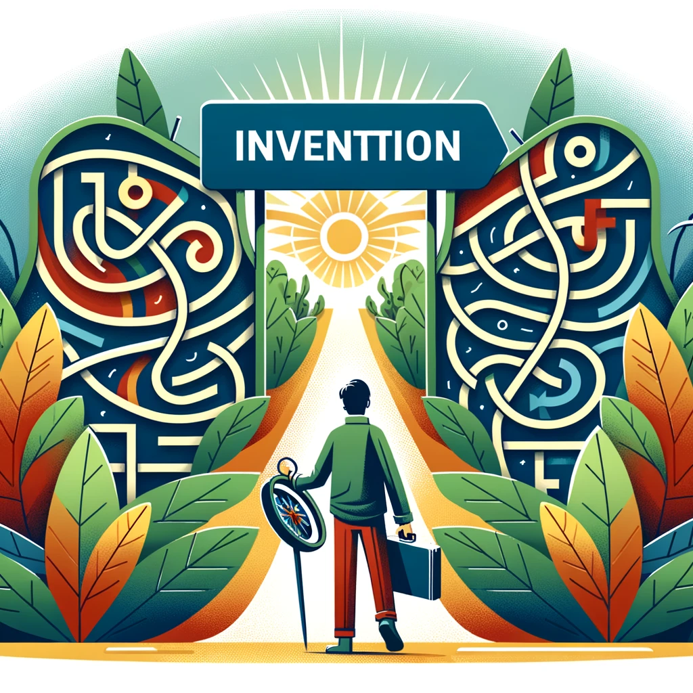
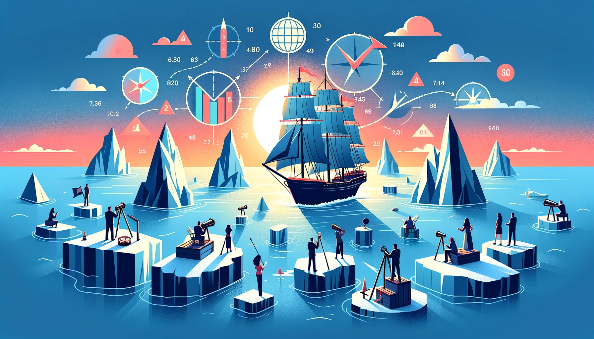
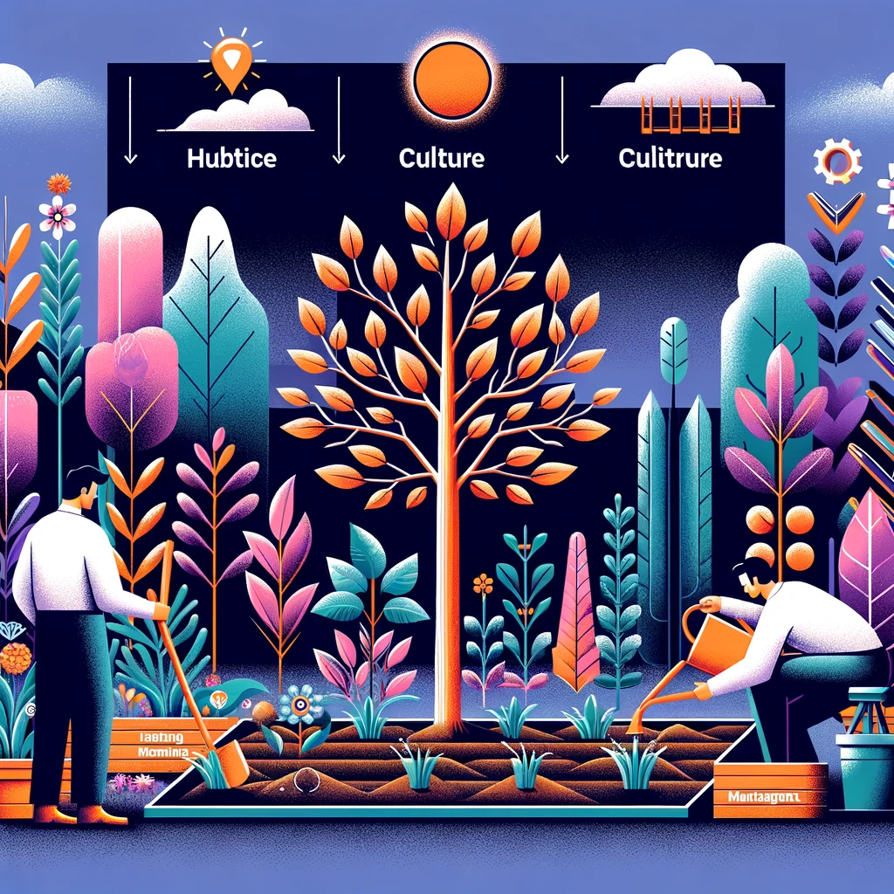

# Вступление

Эта заметка родилась в результате проработки конспекта интервью основателя компании Amazon, Джеффа Безоса, которое он дал ведущему очень крутых интеллектуальных подкастов, Лексу Фридману.

Джефф Безос – основатель компании Amazon, одной из крупнейших технологических компаний в мире. Успех этой компании во многом связан с его личностью и навыками. Всегда интересно наблюдать за личностями подобного масштаба в попытках подсмотреть их подход к делам и жизни.

Материал вышел на YouTube-канале Лекса Фридмана 14 декабря 2023 г. [https://youtu.be/DcWqzZ3I2cY](https://youtu.be/DcWqzZ3I2cY) 
Профессионального перевода пока нет, но энтузиасты выложили автоматический дубляж от Яндекс-браузера: [https://youtu.be/d6WrSUoO-cs](https://youtu.be/d6WrSUoO-cs)

Для меня это интервью – очень ценный материал, который подталкивает на глубокие размышления. Я давно наблюдаю за обрывками менеджерских подходов, доносящимися из компании Amazon. Очень похоже, что где-то в её недрах пользуются Теорией Ограничений, но по какой-то причине никому об этом не рассказывают. Это даже косвенно подтверждается тем, что Безос настоятельно рекомендует своим топ-менеджерам ознакомиться с книгой "Цель" Элияху Голдратта. 
[https://www.businessinsider.com/jeff-bezos-favorite-business-books-2013-9](https://www.businessinsider.com/jeff-bezos-favorite-business-books-2013-9) 
[https://www.intelligentmanagement.ws/exploit-the-constraint-not-people-sorry-mr-amazon/](https://www.intelligentmanagement.ws/exploit-the-constraint-not-people-sorry-mr-amazon/)

Я слышал о том, что многие компании не спешат рассказывать о значительных результатах, достигнутых с помощью Теории Ограничений, потому что не хочется облегчать жизнь своим конкурентам. Возможно, что и компания Amazon придерживается того же мнения. Тем интереснее взглянуть на рассуждение её основателя и на пересечение его идей с идеями и подходами TOC.

## Про обилие идей.

Интервью длится около двух часов. В нём затронуто множество интересных идей. Сначала я хотел подробно расписать каждую из них отдельно, но застрял в процессе подготовки. В идеале, по каждой из идей, упомянутых в интервью, можно написать обширную статью. Я даже начал составлять подробный разбор методов проведения совещаний в Amazon, но понял, что это не моё. Мне не интересно переписывать и обобщать уже существующие материалы. Я уже потратил много времени на этот бесплодный копирайтинг и просто не могу заставить себя продолжать.

Поэтому я принял такое решение. Я просто перечислю эти идеи списком и оставлю для каждой свой комментарий, а где возможно, дам ссылки на дополнительные материалы. Если читателям этого текста будет интересна какая-то из этих идей, вы можете погрузиться в неё через просмотр самого интервью или через материалы, которые я добавлю в дополнительных ссылках.

Итак, список идей, вынесенных из интервью.

# Идея первая и самая объёмная: Способ проведения совещаний в Amazon

В Amazon, по собственным заявлениям и по восторженным отзывам в интернете, очень необычный формат корпоративных обсуждений. Он напоминает мне структуру U-Shape, используемую в TOC для иллюстрации процесса проведения изменений. Суть метода заключается в том, чтобы сначала полностью проработать негативные аспекты текущей ситуации, найти решение для их преобразования в позитивные, тщательно изучить возможные побочные эффекты и разработать детальный план внедрения изменений.

Вот и у Безоса идея примерно такая же. Если мы собираемся, значит, хотим что-то решить. Если мы хотим что-то решить, значит, хотим что-то изменить. Давайте из наших совещаний уберём максимум неконструктива и сосредоточимся над нахождением решения проблемы, заставившей собрать совещание. Дальше мы всеми ЛПР решим, как поступать, разбирая по косточкам проблему и негативные побочные эффекты, подерёмся в процессе, ещё раз подерёмся и так до тех пор, пока все участники не придут к консенсусу по всем вопросам. Т.е., фокус, конечный итог любого совещания по Безосу, должен быть в достижении WIN-WIN решения для всех участников по поднятой проблеме.

**И вот как они это делают:**

- Тот, кто хочет собрать совещание, готовится. И готовится серьёзно. Тот, кто инициирует совещание, обладает знаниями о проблеме, которую необходимо решить. И он делает всё для того, чтобы эту проблему описать, выявить в понятной и сжатой для всех остальных участников форме.
- Форма, в которой описывается подготовка к совещанию, — фиксированная. Это текстовый документ на одной странице (для небольших проблем) или максимум на 6 страницах для серьёзных вопросов. Документы так и называются: amazon 1-pager и amazon 6-pager.
- В документе описывается проблема, решение, внешняя ситуация по отношению к компании, что уже было испробовано для решения проблемы, извлечённые из этого уроки, что будет плохого, если проблема не будет решена, прогнозы, вопросы для предстоящего обсуждения.[Вот пример такого документа.](https://docs.google.com/document/d/1LPh1LWx1z67YFo67DENYUGBaoKk39dtX7rWAeQHXzhg/edit)
- Очень важная часть этого документа — это заголовок "Когда я закончу говорить, участники совещания должны будут ..." То есть в документе явно должны быть прописаны ожидания от участников.
- Подготовка такого документа — дело трудоёмкое. Он готовится руководителем вместе со своими подчинёнными несколько недель.
- Шестистраничный документ — это доказательство того, что ты чего-то действительно хочешь и тебе нужна поддержка этих людей в своей инициативе.
- После того, как документ готов, на него приглашаются люди, которых может затронуть это изменение и от которых зависит решение по этому вопросу.
- Перед собранием участники по желанию могут ознакомиться с содержанием подготовленного документа, но на это никто не рассчитывает. Это нормально, если на совещании этот документ люди увидят впервые. Считается, что в повседневной суете люди имеют право на то, чтобы забыть о подготовке.
- Поэтому на ознакомление с документом всем участникам выделяется специальное время. Время, которое нельзя потратить на другие задачи. И это время — когда совещание началось. Это делается специально, чтобы участники не смогли из-за повседневной суеты снизить качество подготовки к совещанию. Например, просмотрев документ по диагонали, сразу броситься в его обсуждение. Нет. Подготовка должна быть полной, с использованием всего доступного внимания и мыслительных ресурсов. Именно для этого в начале совещания даётся специальное время на ознакомление с подготовленным документом.
- Встреча начинается с полной тишины. Все читают подготовленный документ в течение 30 минут. Если кто-то хочет сказать что-то через 5 или 10 минут после начала, то нет. Ему нельзя нарушать тишину и нужно ждать истечения этих 30 минут. От участников ожидается полное погружение в материал. Проработка его, размышление над ним. Участники внимательно читают, делают пометки на полях. Использование компьютеров не приветствуется, только если он нужен для разговора с сотрудником на удалёнке.
- Когда 30 минут истекает, начинается конструктивное обсуждение. Участники стараются выйти на противоречия друг с другом и решить их.
- Это намного лучше, чем презентации в PowerPoint, потому что ваша цель не продать вашу идею, а обсудить, взвесить и решить проблему.
- Этот процесс также способствует групповому мышлению, не затыкая рот докладчика преждевременными возражениями и представляя возможность каждому участнику независимо обдумать материал и подготовить собственные мысли, не затенённые чьим-нибудь авторитетным мнением.
- В итоге они имеют чёткий, жёсткий, структурированный формат подготовки к совещаниям, но сами обсуждения беспорядочные, боевые, направленные на единую цель и потому конструктивные. Очень похоже на мозговой штурм при выработке решения через Грозовую Тучу или при попытке придумать способы отсечения негативных ветвей (побочных эффектов решения).
- И подготовка к совещаниям, и их длительность — мозгоносные по сложности мероприятия. Кажется, что это занимает кучу времени и сил. Но в долгосрочной перспективе это экономит время компании на выработку решения, а сами решения становятся более качественными, продуманными и простыми в реализации.

**Материалы для ознакомления с форматом документов Amazon:**
- https://www.linkedin.com/pulse/amazons-tools-one-pager-six-backwards-press-release-hermina-reicher](https://www.linkedin.com/pulse/amazons-tools-one-pager-six-backwards-press-release-hermina-reicher)
- https://www.azeusconvene.com/articles/amazon-6-pager-the-ideal-template-for-hybrid-meetings](https://www.azeusconvene.com/articles/amazon-6-pager-the-ideal-template-for-hybrid-meetings)
- https://www.journalowl.com/blog/the-complete-breakdown-of-amazons-6-page-memo-process-and-how-to-do-it-online](https://www.journalowl.com/blog/the-complete-breakdown-of-amazons-6-page-memo-process-and-how-to-do-it-online)
- https://www.factoftheday1.com/p/february-23-how-amazonians-share

# Идея вторая: Двухсторонние и односторонние решения.

В интервью Джефф Безос обращает внимание на два типа решений, которые должен принимать менеджмент. Здесь он приводит аналогию с дверью. Существуют двери, в которые можно войти и вернуться обратно, если ситуация за ней вам не понравилась. А есть двери, в которые вы вошли и всё, поезд уехал, а вы остались навсегда с изменившейся ситуацией.

Так и решения, по Безосу, могут быть двух типов:

1. Первый тип — двухсторонние решения. Решения, которые легко отменить и без существенных потерь вернуть ситуацию в прежнее русло. Мало риска и низкие затраты при изменении курса.
2. Второй тип — односторонние решения. Решения с высоким уровнем риска и значительными последствиями при изменении или отмене. Труднообратимы. Если вы приняли такое решение, это дорога в один конец. Фарш невозможно провернуть назад. Принятие таких решений должно быть максимально взвешенным и обдуманным. Торопиться нельзя, нужно учесть всё по максимуму.

Эта концепция в моей голове очень сильно ассоциируется с концепцией проработки негативных ветвей ([NBR](https://bipulse.ru/app/dictionary/docs/negative%20branch%20reservation)) в Теории Ограничений.
При проработке NBR мы просто вынуждены оценить все негативные последствия, вызванные нашими решениями, и постараться придумать, как устранить эти побочные эффекты.
Видимо, примерно на этом этапе и происходит идентификация на первый или второй тип решений.

При этом это не всегда решение только на управленческом уровне. На техническом уровне также существуют высокорисковые односторонние решения.

В качестве примера Безос приводит выбор типа топлива для будущей ракеты. Если мы выбираем определенный тип топлива для ракеты, то под него подстраивается вообще все остальное: характеристики и параметры самой ракеты, стартовая площадка, концепция полетов и т.д. Если мы ошиблись в выборе топлива, то весь проект можно закрывать.

Прорабатывать все решения таким же способом, как односторонние, очень накладно и сильно замедляет организацию.
Поэтому каждый управленец должен уметь определять первый тип решений от второго и в случае тяжелых последствий для компании сообщать об угрозах на самый верх.

# Идея третья: Противоречия и win-win решения

Одной из основных вещей, которые меня удивили в этом интервью, это то, как Джефф Безос рассказывает о конфликтах и противоречиях. Всё, что он пытается донести на эту тему, очень сильно пересекается с тем, что мы знаем из Теории Ограничений. Взгляд Безоса на противоречия абсолютно такой же, как и у людей, занимающихся TOC.

Вот Безос приводит такой пример:
Допустим, мы с вами поспорили, какой высоты потолок. Я говорю — 10 футов. Вы говорите — 12.
Можно спорить до победного. Пока одна из сторон не устанет и не согласится, лишь бы уже закончить этот разговор. Это плохой способ. Он тратит кучу энергии и принимает в расчетах только одну позицию, теряя полноту картины.
Можно пойти на компромисс, сказать, пусть будет 11 футов. Ни тебе, ни мне. Это плохое решение. Оба недовольны, да к тому же мы не приблизились к пониманию, как устроен мир, и не можем принимать верные решения в такой ситуации. Компромисс — это быстрое, энергоэффективное и плохое решение.
В идеале нужно решать каждое противоречие так, чтобы все стороны были довольны. Добиваться консенсуса по вопросу. Например, взять рулетку, да померить — достоверно убедиться в высоте потолка. Только тогда мы сможем принять верное решение, например, чтобы заказать шкаф нужной высоты.

Безос подчеркивает, что принятие решений — это именно то, от чего зависит скорость работы всей организации. Следовательно, на каждом уровне иерархии управления должны уметь принимать качественные решения. И принимать их быстро. Поэтому все управленцы в компании должны уметь работать с противоречиями. И для этого нужно выстраивать в компании культуру этой работы. У Amazon такая культура есть, и это очень круто!

Ещё один момент насчет принятия решений и противоречий. Иногда, даже если противоречие решено таким образом, что все стороны согласны, возникает чувство: "Ты, конечно, прав, но осадочек остался". По какой-то причине не происходит внутреннего согласия с выработанным решением. Возникает желание оказывать сопротивление принятому решению, бойкотировать его, спускать на тормозах.
В TOC этот момент называется "Шестой слой сопротивления изменениям" — невербализированные страхи и сомнения.
Для борьбы с этим явлением в Amazon существует культура следования принципу "не соглашайся и подчиняйся" (Disagree and Commit). Это о том, что если уж решение принято, то каждый должен сделать всё, чтобы оно осуществилось. Не просто "не мешать", а оказывать всестороннюю помощь и поддержку решению, даже если с ним не согласен внутренне.

Давайте тезисно ещё раз очертим основные пункты этого раздела:
- Любое развитие происходит через противоречие и конфликты. Через нахождение противоречия, его преодоление и принятие плана дальнейших действий.
- Каждое принятие решений содержит в себе противоречие.
- Решения должны приниматься быстро.
- Компромисс — наихудшее, что можно сделать в принятии решения.
- Необходимо поощрять коммуникацию людей для выявления скрытых противоречий и организовывать процесс их разрешения в формате WIN-WIN, а не в формате заталкивания противоречия под ковёр или принятия компромисса.
- Если решение принято, обязанность всех сторон — всеми силами способствовать его реализации. Необходимо воспитывать в сотрудниках доверие к команде и её решениям, даже если конкретный сотрудник с этими решениями не согласен.
- Культура компании играет очень важную роль. Необходимо выстраивать эту культуру, вводить все эти правила и инструменты в "привычку" так работать изо дня в день.

# Идея четвёртая: Иерархия и культура безопасного высказывания необычных идей.
.png)
Здесь Безос раскрывает тему социальности и племенного поведения внутри компании. Он расскзывает почему важно, чтобы новички всегда выступали первыми, а старые и опытные большие начальники - последними. 

- Люди животные
- Люди социальные животные
- При возникновении конфликтной ситуации люди склонны оценивать её с точки зрения социальных вопросов:
	  - Безопасности себя в обществе
	  - Выгоды для себя 
	  - Влияния на позицию в иерархии
- Поиск правды не является вещью, которую люди желают добиться по умолчанию.
- Правда в подавляющем случае будет жертвой социальных игр.
- Правда часто бывает горькой. И индивидууму очень часто не выгодно её выносить на поверхность, ведь это может поставить его племя или его лично в невыгодном свете. 
- Нужно работать над системой, средой, в которой наши социальные, животные инстинкты не мешали бы нам думать и принимать рациональные решения.
- Иерархия есть в любом обществе. Люди всегда выстраивают иерархию. Критерии для неё разные, но она вегда возникает. Нужно уметь с этим работать.
- Поскольку иерархии есть везде, важно создать такие условия, когда даже самый большой, самый новый, самый неопытный сотрудник может спорить с самым опытным, с самым главным, если у него есть необходимые аргументы и обоснования.
- Очень легко последовать за лидером или более опытным человеком. Так хочется согласиться с ним и не спорить. Очень сложно перебороть себя и поставить его слова под сомнение.  Под давлением экспертности люди волей-неволей хоть чуть-чуть да изменят свою мнение. Это происходит автоматически, без участия сознания.
- Одним из элементов культуры правды в компании может быть правило при котором чем выше ты находишься в иерархии, тем позже ты высказываешься. Первыми всегда говорят новички.
- Нужно выстраивать такую культуру в компании, которая делала бы правду частью этих социальных игр. Критерием, по которому ты получаешь плюшки от социума и критерием, по которому ты можешь потерять уважение социума.

# Идея пятая: развитие техники и изобретательство

Где-то на 22-й минуте Безос рассказывает о своем понимании процесса изобретения. Говорит примерно следующее:

> Настоящее изобретение — это не просто постепенное улучшение. Это  движение исследовательское, причем в не понятном направлении. Это что-то необъяснимое, это движение в пространстве высокой размерности, где каждый следующий шаг остаётся неопределённым.
> 
> Этот процесс напоминает игру ребёнка: спонтанный и не направленный на достижение конкретной цели. Ребёнок просто играет.
> 
> Невозможно изобрести что-то новое, постепенно, по чуть-чуть, улучшая старое. Настоящее изобретение — это всегда прорыв. Это нестандартные решения проблемы, которые ещё никто не применял. Настоящее изобретение требует блуждания.

Не совсем здесь согласен. Действительно, сложно сделать что-то новое по чуть-чуть улучшая старое  —  нужен прорыв. Но для того, чтобы сделать прорыв блуждать необязательно. ТРИЗ и TOC предлагают нам способы понять, в какую точку мы хотим попасть, куда нам нужно стремиться, сформулировать и разрешить противоречие, которое мешает нам оказаться в этой точке, разрешить его и построить маршрут до этой точки. 

# Идея шестая: мир становится лучше через гениальные изобретения.

В Теории Ограничений существует парадигма, что есть два подхода к повышению отдачи от организации: "мир затрат" и "мир прохода". "Мир затрат" означает, что менеджмент компании концентрируется на себестоимости продукции, на том, сколько они тратят, чтобы произвести value для клиента. Если же управленцы мыслят в режиме "мира прохода", то они сконцентрированы на увеличении маржинальной прибыли компании в единицу времени, например, за год. Мы либо заняты "оптимизациями" в надежде выиграть чуть больше с той же грядки, либо думаем, что бы такое сделать, куда инвестировать, чтобы перемалывать больше за то же время. Совершенно разные способы мышления!

Сперва я подумал, что Безос говорит про затраты в разрезе "мира затрат". Но его мысль, похоже, чуть шире. Он подмечает, что всё, что мы сейчас имеем, — результат какого-то изобретения и приводит вот такую иллюстрацию:

> Возьмём отрасль сельского хозяйства. До изобретения плуга земледелие было очень трудоёмким процессом, который требовал значительных усилий для обработки земли вручную. Это ограничивало объёмы производства пищи, её хватало едва-едва. Но люди как-то жили, выживали.

> Когда же кто-то придумал, что можно использовать мускульную силу животных, привязав к ним устройство для вспахивания, так случилась сельскохозяйственная революция. За счёт плуга значительно увеличилась производительность труда, позволяя обрабатывать большие площади земли за меньшее время. Еды стало больше. Люди стали жить лучше. Численность населения резко выросла. Человечество стало расселяться на те территории, где раньше жить было невозможно.

Безос преподносит изобретение как снижение затрат на один и тот же вид труда. Другой, лучший способ делать то же самое. Я же смотрю на это немного по-другому. Изобретение — это новый способ, лучше удовлетворяющий старые потребности. Такая формулировка лучше сочетается с понятием прохода — мы можем получать больше единиц цели за то же время. В примере с сельским хозяйством новое изобретение позволило нам получать больше еды за год.

В любом случае, основной посыл этого раздела: "Только инновационные идеи двигают человечество вперёд к лучшей жизни". Если ты смог изобрести и довести до реализации такую идею, то ты можешь называться гением, ведь ты сделал весь мир чуть лучше для всех.

А вот для того, чтобы изобрести подобную инновацию, всегда нужно решить противоречие.

# Идея седьмая: Масштабирование производства – это тоже изобретение.

Сейчас вы читаете этот текст с электронного устройства: со смартфона, планшета или дисплея компьютера. Когда подобные изобретения входят в нашу жизнь, мы часто восторгаемся ими. Нам кажется, что вот оно – то гениальное изобретение, которое изменило мир.

Но Джефф Безос обращает внимание на то, что в тени каждого такого технологического прорыва стоит не менее амбициозная задача: производственный конвейер. Масштабирование производства – это не просто следующий шаг после создания прототипа; это отдельное, чрезвычайно сложное изобретение.

Когда Генри Форд создал Ford T, прорыв был не в самом автомобиле, а в способе его производства. Именно конвейер позволил делать качественные автомобили быстро, недорого и в большом количестве. Именно с началом массового производства стал расти рынок, открываться новые предприятия по добыче нефти, её переработке, производстве резины, строительстве дорог. Без конвейера автомобиль так бы и остался мелкосерийной игрушкой для богатеньких счастливчиков. По большому счету, именно конвейер Форда был наиболее значимым изобретением во всей индустрии.

Другой пример приводит сам Джефф, рассказывая про свою ракету. Создание штуковины, способной доставить груз в космос, — это лишь полдела. Гораздо сложнее организовать такое производство, которое позволит делать это регулярно, надёжно и быстро. Каждая ракета требует точности до мельчайших деталей, и организация производства, способного обеспечить такую точность на массовом уровне, требует намного больших инноваций, чем разработка самой ракеты.

Организация массового производства – это задача, требующая не меньше творчества и гениальности, чем производство единичных экземпляров изделий. Помните об этом, когда в следующий раз будете восторгаться очередной гениальной инновацией.

# Идея восьмая: Ключевые показатели - опасная штука

Для того чтобы управлять, необходимы индикаторы. Они предоставляют информацию о работе организации, её состоянии и необходимости принятия управленческих мер.

Важно помнить, что система которой мы управляем не статична. Она изменяется как сама по себе, так и под давлением внешнего мира. Из-за этих изменений метрики, которые раньше работали хорошо, могут перестать выполнять свою функцию, предоставляя вам ложную информацию.

Этот фактор особенно остро сказывается в крупных организациях, где может возникнуть ситуация, когда метрику вводил один состав управленцев для решения определённых задач, а сейчас, спустя N лет, её использует совершенно другой состав управленцев для других целей. И никто уже не может вспомнить, какую первоначальную проблему должен был решить этот показатель.

Так же существует фактор взлома показателей со стороны сотрудников. Как только вы вводите метрику, люди начинают стремиться достичь её, зачастую не теми способами, которые задумывались изначально. В итоге может оказаться, что метрика приносит организации скорее вред, чем пользу.

Именно поэтому метрик должно быть мало. Каждая из них должна быть осмысленной, и каждый такой индикатор должен периодически подвергаться сомнению и актуализации. Метрики — опасная штука, но без них невозможно обойтись в управлении. Старайтесь организовывать работу так, чтобы их было как можно меньше.

Здесь могу порекомендовать отличный доклад Александры Брызгаловой про KPI и как оно бывает в жизни:
https://t.me/AABryzgalova/144

# Идея девятая: будьте открыты к пересмотру своих убеждений.

Джефф рассказывает, что иногда у нас есть такие глубокие убеждения, которые мы никогда бы даже не подумали поставить под сомнение. На основе этих убеждений мы принимаем решения. Эти убеждения основаны на догадках, личном опыте, интуиции.
Когда-то эти убеждения нам помогали, но жизнь меняется, и что, если какие-то из них перестали быть актуальными? Значит, мы принимаем решения, основанные на уже не актуальных убеждениях. И это делает наши решения плохо соотносящимися с реальностью.

В пример Безос приводит историю, когда они считали, что у Amazon очень быстрая реакция на звонки в службу поддержки. Они были абсолютно уверены, что всегда отвечают за одну минуту. Это происходило до тех пор, пока статистика по обращениям не стала настораживать. Тогда они прямо на одном из совещаний высоких директоров позвонили в собственную службу поддержки и слушали гудки больше 10 минут.
Закостенелые установки в скорости ответа не позволили никому из рядовых управленцев провести этот эксперимент самостоятельно. В итоге проблема не решалась долгое время, пока не вышла на самый верх.

В личной жизни с такими приносящими вред установками нам обычно помогает справиться психолог. Но что делать, если мы имеем дело с коллективом? Что или кто может помочь целой компании трезво взглянуть на ситуацию и пересмотреть устаревшие убеждения?

В Теории Ограничений есть подобные мыслительные инструменты. Их несколько, и они все связаны друг с другом. Но для примера выше хотел бы подсветить один не особо известный инструмент "Научение на одном событии". Это подход, который позволяет запустить процесс пересмотра коллективных убеждений целой компании на основе всего одного случая, когда мы сталкиваемся не с тем результатом, которого ожидали.

Подробности вы можете почитать в статье Эли Шрагенхайма, классный перевод выполнил Дмитрий Егоров: https://egorovde.ru/archives/4402

# Идея десятая: Две отдельные команды - развитие и отсечение проблем сейчас.

Внимание менеджмента в компании всегда ограничено. Его на всё не хватает. Задачи, на которые расходуется это внимание, обычно связаны с двумя типами вопросов: что нужно сделать, чтобы дела шли хорошо сейчас (краткосрочные цели и стратегии) и что нужно делать сейчас, чтобы хорошо было в будущем (долгосрочные стратегии, большие проекты и инвестирование).
Закопаться по самую макушку можно в каждом из этих направлений. Часто менеджмент вынужден тратить свое внимание и на то и на другое одновременно. Переключаясь, теряя фокус, размывая цели. Это снижает скорость и качество принимаемых решений.

Джефф Безос рассказывает, что они решили эту проблему, разделив мощность на две отдельные команды. Одна занимается стратегическими проектами долгосрочного развития, а другая работает над так называемыми "paper cuts".

Эта мощность разделена не равномерно. Большая часть энергии всей компании уходит именно на проекты развития. 

Это во многом связано ещё и с тем, что по-настоящему важные вещи, по словам Безоса, стабильны во времени и слабо изменяются. 
В качестве примера он приводит качество сервиса для своих клиентов: даже через 10 лет для пользователей Amazon будет важно, чтобы товары стоили как можно меньше и доставка была как можно быстрее. Слабо представляется такая ситуация, когда клиент будет жаловаться на низкие цены или быструю доставку.
Подобные ориентиры стабильны в долгосрочной перспективе. Поэтому можно спокойно вкладываться в дорогие и длинные проекты развития, для улучшения этих параметров.

Но никуда не деваются куча мелких проблем, раздражающих вопросов, которые нужно решать прямо сейчас. Это и есть то, что они называют "paper cuts". Они мешают клиентам или сотрудникам. Забить на эти вещи нельзя, нужно, чтобы кто-то занялся их устранением.

Если у вас одни и те же люди будут заниматься и "paper cuts" и проектами развития, то всегда будет что-то страдать. Либо вы погрязнете в текучке, и вам будет не до долгосрочной стратегии, либо ваши руки никогда не доберутся до "мелочей", и основной бизнес начнёт стагнировать.

Термин "paper cuts" мне очень напоминает термин из Теории Ограничений - нежелательное явление (НЖЯ). Что-то, что раздражает, и от чего хотелось бы избавиться.
Судя по тому, что рассказывает Безос, работа над этими "paper cuts" у них выстроена системно. 
Он приводит такой пример.  У них было множество таких вот PaperCuts, связанных с покупкой в интернет-магазине, а потом они придумали кнопку покупки в один клик. И это решило сразу множество проблем. 
Это очень похоже на решение корневого конфликта в TOC, когда одно решение устраняет сразу кучу нежелательных явлений и добавляет кучу желательных.
Безос прямо акцентирует внимание на этом процессе. Я думаю, они точно что-то знают про TOC!

Разделение мощности на две категории и назначение отдельных команд для их решения позволяет компании одновременно и двигаться вперед, и улучшать текущее положение вещей.
Работа над обоими направлениями выстроена по-разному. Для стратегии действуют одни правила, для поддержки "штанов" - другие. Ничего не путается и не мешает друг другу. Отличный, системный подход к ведению дел.

# Заключение

Десять идей, о которых шла речь выше, отражают то, как информация из интервью преломилась через мою призму восприятия. Рекомендую вам прослушать это интервью самостоятельно — возможно, вам придут в голову совершенно другие мысли или идеи.

Если же вы попросите меня выделить из этого набора идей основные, то я бы описал их так:
- Развитие предприятия тесно связано с вниманием менеджмента. Если управленцы погружены в повседневные задачи, то на развитие у них не остаётся времени.
- Большая часть времени руководителя уходит на коммуникацию и принятие решений.
- Чтобы делать то, что нужно, нужно перестать делать то, что не нужно.
- Формат совещаний в Amazon позволяет отказаться от ненужного при коммуникации и принятии решений. Этот формат сосредотачивается на важном, отбрасывая лишнее. Если ввести в привычку компании работать, обсуждать, размышлять и принимать решения в таком формате, это с одной стороны освободит ресурсы руководителей для важных дел, которые кроме них никто не может сделать, а с другой стороны позволит принимать более осмысленные и продуманные решения быстрее.
- Обратите внимание на концепцию WIN-WIN решений, получающихся при разрешении противоречий. Противоречия — это очень мощный инструмент, если научиться их выявлять, формулировать и размышлять в этой парадигме, это не только повысит качество ваших решений, но и упростит жизнь как вашу, так и людей, с которыми вы работаете.
- Обратите внимание на концепцию культуры. Культура в организации — это как привычка у обычного человека. Можно сколько угодно проходить тренинги, писать правил и регламентов, изучать книги, и это все будет бесполезно, если не существует привычки применять на практике полученные знания. Вот эта привычка применения концепций на практике в организации и называется культурой. Культуру нужно поощрять, поддерживать, развивать. И создание культуры — это дело не одного дня, а иногда и не одного года.

