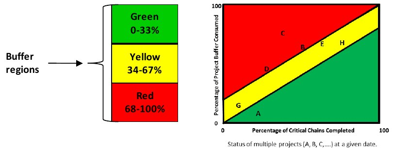

Управление буфером это [один из](%D0%9F%D1%80%D0%BE%D1%86%D0%B5%D1%81%D1%81%20%D0%BD%D0%B5%D0%BF%D1%80%D0%B5%D1%80%D1%8B%D0%B2%D0%BD%D0%BE%D0%B3%D0%BE%20%D1%83%D0%BB%D1%83%D1%87%D1%88%D0%B5%D0%BD%D0%B8%D1%8F%20(POOGI).md) важнейших механизмов управления которые нам даёт TOC.

Буфер может состоять из времени или запасов в зависимости от контекста решения.

Буфер делят на три равные части: красную, желтую и зелёную.

Красная - мало запаса. Желтую - запаса достаточно. Зелёную - запаса много.

Само по себе управление буфером выполняет функции:

- Управление приоритетами задач. Это управление осуществляется на основе обратной связи о том, сколько процентов буфера уже потрачено

- Если буфер находится в красной зоне (запаса мало), то у нас появляется сигнал о том, что что-то нужно ускорить.

- Буфер помогает планировать деятельность на будущее. Это происходит на основе обратной связи о его размере и скорости его потребления.

- Буфер наглядно подсвечивает задержки и помогает сосредоточить внимание на основных причинах этих задержек. Таким образом происходит улучшение текущей деятельности.

источники:
[1] `THE TOCICO DICTIONARY Second Edition, 2012 (p.14)`
